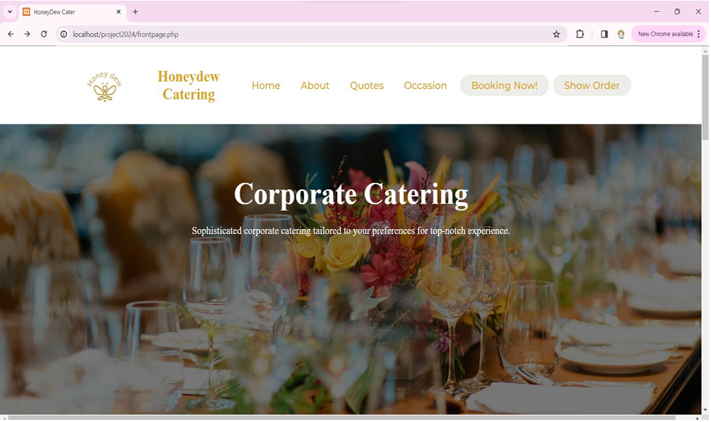
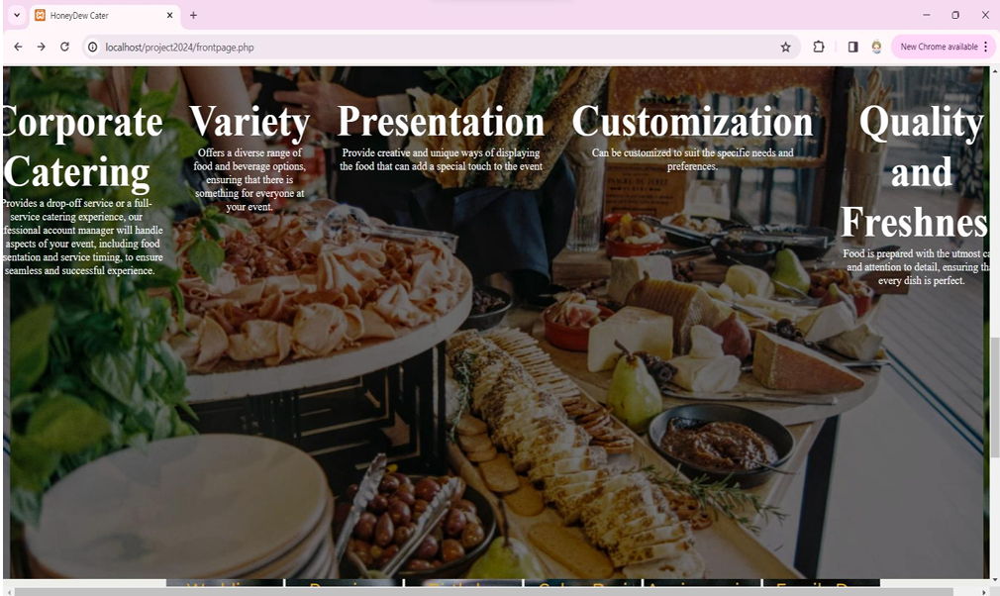
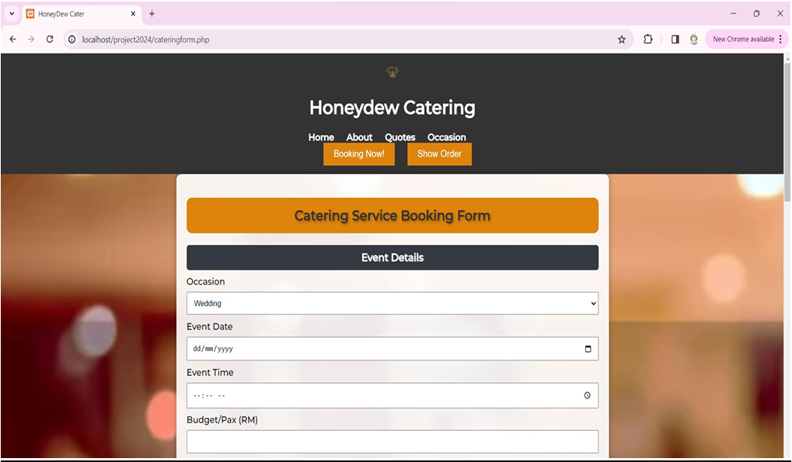
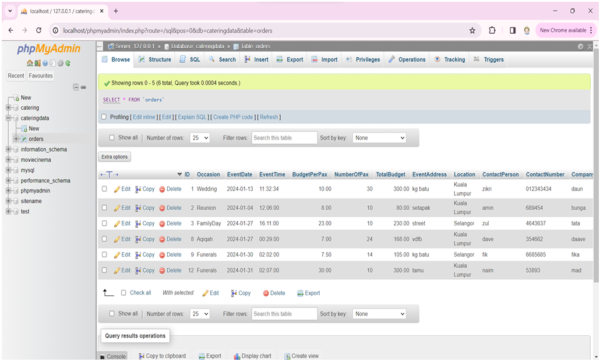

# HoneyDew-Catering-Website---Catering-Booking-System
A corporate catering order management website developed using HTML, CSS, and PHP, with MySQL (phpMyAdmin) as the database. The system allows customers to submit catering requests, and administrators can manage and view orders with full CRUD (Create, Read, Update, Delete) functionality.

## 📸 Screenshots

### Homepage

### Catering Order Form

### Booking Database

